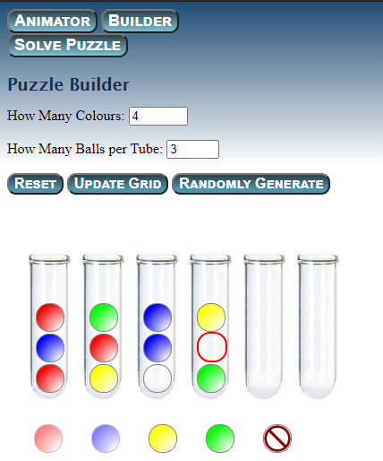

Ball-sorter
===============

Ball sort puzzle solver visualizer and puzzle builder
----

I recently started playing one of those ball sort puzzle games on my phone.  This led tme to looking for a solver once I got into the 600s, which is when I found <a href="https://github.com/tjwood100/ball-sort-puzzle-solver" target="_blank">this solver</a>. It worked but was very hard to use to actually solve larger puzzles due to it being terminal based. 

Here are two tools that I built using plain JavaScript and CSS (as a good refresher) related to puzzles from games like <a href="https://play.google.com/store/apps/details?id=com.spicags.ballsort&hl=en_US&gl=US" target="_blank">Ball Sort Puzzle </a> and all of the similar games.  

Ideally you would build the grid you want to solve, solve it using that solver and then send it to my animator. As the original only outputs text, I had to modify it to make it output a JSON file I could work with.  So because there is no way to do it yourself **right now**, I have included several solved puzzles you can see in the Solver, and you can build and generate JSON for any puzzle you like.  

Currently you must copy the JSON and save it, as I am not using Node on this project.

Both tools are fairly complete, and polished, but not perfect. 

Solver Animator
-----

This is the first one I made.  

You can select the puzzle to solve from the dropdown list of presolved puzzles.

You can move through the stages using the buttons or the keyboard:
- Up: Go to beginning
- Down: Go to end
- Left: Back one stage
- Right: Forward one stage
- Space: Play/Pause

You can play the animation.  Additional controls appear when you start it.  Default time between frames is 1 second.  Each speed adjustment changes the cadence by 200ms, between 200 and infinity.  

To quote the author, the solver has: ** a couple of other minor optimisations but otherwise it's pretty naive.**  This means that you'll see it making the odd 'dumb' move, so the total number of steps is higher than an optimal solve.  But it works. 

Builder
----

The builder allows you to create an existing puzzle, and output it to JSON.  Currently you have to copy the JSON it gives you, I'm not writing the file.  

1. Select how many colours (there will be 2 more tubes than this number for the 2 blank) and how many balls per tube. Click Update Grid to apply the changes to the size.
2. Fill in the highlighted ball by clicking on the corresponding colour on the bottom row.  The selection will automatically move to the next one. 
3. Once the grid is complete, click Generate JSON and copy the output JSON, and save it to a file.

You can click on any ball in the tubes at any time to select it and assign it a colour.  If you want to remove the colour from a ball, because say you mixed two colours up but the grid is complete, click the 'clear' ball - the one at the far right, and then you can reassign them. 

When you have used the maximum number of one colour, the ball to select it will be greyed out - and you will get a message saying it's been maxed out. 

